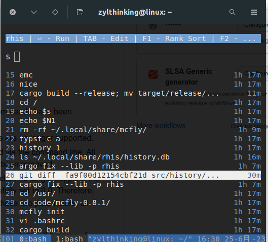

# rhis: A Modified Version of McFly

  

This is a modified version of McFly 0.8.1.

Several features of McFly have been simplified in rhis:

1. Only the Init/Add/Search subcommands are included, and the remaining two subcommands have been removed.
2. Only bash versions that have implemented `bind-x` are supported, and other shells are no longer supported.
3. Only the settings for dark/light themes and UI placement (top/bottom) are supported via the command line. All other settings are no longer supported, and all custom environment variables have been removed.
4. The database will no longer infinitely expand. As a consequence, the `nn_rank` function no longer supports the `overlap_factor` and `immediate_overlap_factor` parameters, and they are forcefully set to 0.0. Therefore, there might be some differences between the candidate list and McFly. Apart from these two parameters, all other parameters should remain the same.

Due to these simplifications and certain code adjustments, the codebase of rhis is approximately half the size of McFly.

Here are some feature enhancements:

1. No longer uses temporary files on disk.
2. UI flickering should be reduced compared to McFly, and No padding exists in candicate lists between the command and the timestamp
3. UI rendering no longer leaves artifacts, and the window will be correctly redrawn when resizing. Long input commands will not overlap the candidate list (although there is now a maximum length limit for input commands).
4. Supports scrolling of the candidate list when it exceeds the window size.
5. The database will no longer infinitely expand, eliminating potential slowdown issues.
6. When encountering errors in the Add/Search subcommands, rhis avoids panicking and disrupting the user's shell, although this has not been implemented thoroughly.
